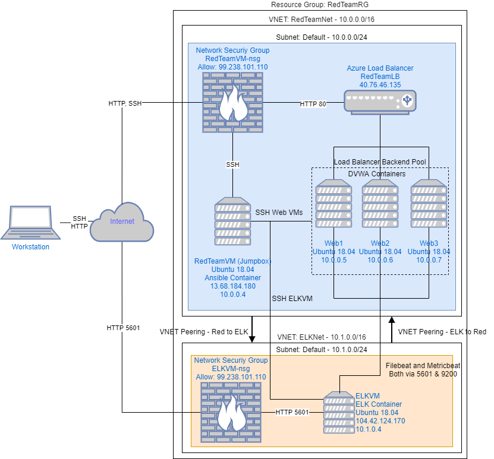
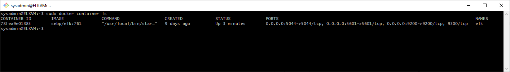

## Automated ELK Stack Deployment

The files in this repository were used to configure the network depicted below.

  



These files have been tested and used to generate a live ELK deployment on Azure. They can be used to either recreate the entire deployment pictured above. Alternatively, select portions of the `install-elk.yml` file may be used to install only certain pieces of it, such as Filebeat.sss

This document contains the following details:
- Description of the Topology
- Access Policies
- ELK Configuration
  - Beats in Use
  - Machines Being Monitored
- How to Use the Ansible Build


### Description of the Topology

The main purpose of this network is to expose a load-balanced and monitored instance of DVWA, the Damn Vulnerable Web Application.

Load balancing ensures that the application will be highly available, in addition to restricting access to the network. Load balancing also reduces the attack surface available by allowing us to keep our web servers private and filtering traffic to the ports we specify.

In addition to load balancing, a jumpbox is used to centralize all administrative related activity. This is advantageous because we can control user activity within the jumpbox to prevent the likelihood of a hack or exploit. We would otherwise be using multiple potentially insecure devices (one for each administrator) which greatly increases the chances of a security event.

Integrating an ELK server allows users to easily monitor the vulnerable VMs for changes to the file system and system metrics. 

The configuration details of each machine may be found below.

| Name      | Function         | IP Address | Operating System |
|---------- |------------------|------------|------------------|
| RedTeamVM | Gateway/Jumpbox  | 10.0.0.4   | Ubuntu 18.04     |
| ELKVM     | ELK Host         | 10.1.0.4   | Ubuntu 18.04     |
| Web1      | DVWA Host        | 10.0.0.5   | Ubuntu 18.04     |
| Web2      | DVWA Host        | 10.0.0.6   | Ubuntu 18.04     |
| Web3      | DVWA Host        | 10.0.0.7   | Ubuntu 18.04     |


### Access Policies

The machines on the internal network are not exposed to the public Internet. 

Only the RedTeamVM and ELKVM machines can accept connections from the Internet. Access to this machine is only allowed from the following IP address: 99.238.101.110


Machines within the network can only be accessed by RedTeamVM.

A summary of the access policies in place can be found in the table below.

| Name      | Publicly Accessible | Allowed IP Addresses |
|-----------|---------------------|----------------------|
| RedTeamVM | Yes                 | 99.238.101.110       |
| ELKVM     | Yes                 | 99.238.101.110, 10.0.0.4 |
| Web1      | No                  | 10.0.0.4             |
| Web2      | No                  | 10.0.0.4             |
| Web3      | No                  | 10.0.0.4             |

### Elk Configuration

Ansible was used to automate configuration of the ELK machine. No configuration was performed manually, which is advantageous because configuration can be applied to an arbitrary number of machines with minimal effort should horizontal scaling be necessary.


The playbook implements the following tasks:
- Downloads and installs docker
- Downloads and installs pip
- Increases maximum memory available to VM
- Launches a docker ELK container
- Enables docker on boot

The following screenshot displays the result of running `docker ps` after successfully configuring the ELK instance. 



### Target Machines & Beats
This ELK server is configured to monitor the following machines:

| VM   | IP       |
|------|----------|
| Web1 | 10.0.0.5 |
| Web2 | 10.0.0.6 |
| Web3 | 10.0.0.7 |
 

We have installed the following Beats on these machines:
- Filebeat
- Metricbeat

These Beats allow us to collect the following information from each machine:

1. **Filebeat** monitors and collects log files as specified during configuration and forwards them to Elasticsearch or Logstash for further processes. Filebeat tracks things such as ssh login attempts and changes to user passwords.
2. **Metricbeat** monitors and collects system and service metrics and ships them to Elasticsearch or Logstash. Metricbeat tracks things such as docker container count as well as cpu utilization and memory usage.

### Using the Playbook
In order to use the playbook, you will need to have an Ansible control node already configured. Assuming you have such a control node provisioned: 

SSH into the control node and follow the steps below:
- Copy the `config/install-elk.yml` file to `/etc/ansible/`.
- Update the `hosts` file to include...
  - a new section called "elk"
  - the elk machine's ip and the python interpreter used
   
  ```
  [elk]
  10.1.0.4 ansible_python_interpreter=/usr/bin/python3
  ```
- Run the playbook, and navigate to `<ELKVM_Public_IP>:5601/app/kibana` to check that the installation worked as expected.
